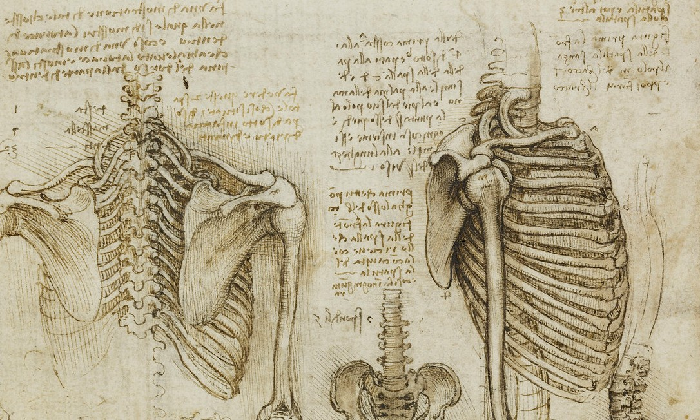
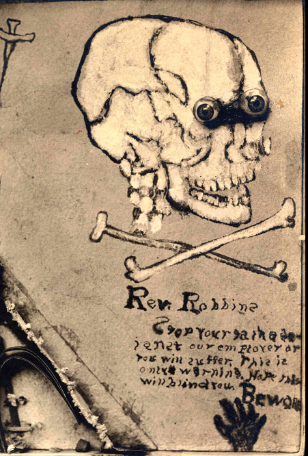
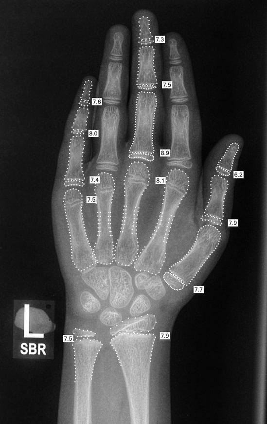
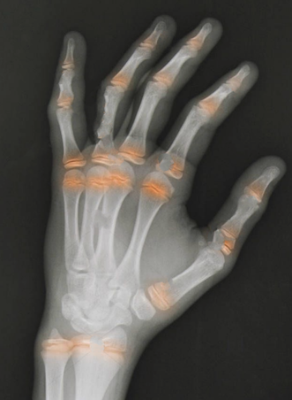
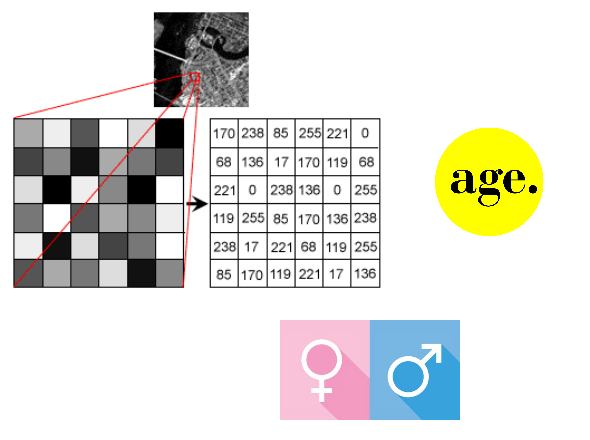
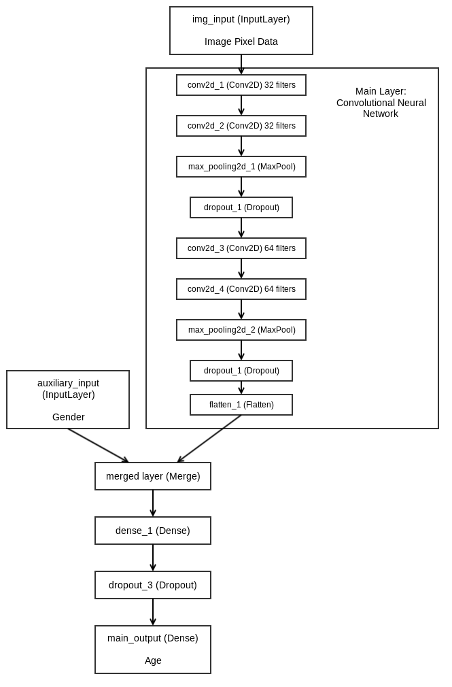

\captionsetup{justification=centering,margin=3.5cm}

<style type="text/css">
body{ /* Normal  */
      font-family: Helvetica;
      font-size: 14px;
      height: 100%;
      margin: 0;
      padding: 0;
  }
  
p.caption {
  font-size: 0.8em;
}
</style>

```{r klippy, echo=FALSE, include=TRUE}
library(klippy)
klippy::klippy()
```

<div id="container" float:right; style="position: relative; width:10px;height:10px;">
<div style= "float:right;position: absolute; top: -175px; left:505px; padding-left: 10px;width: 450px">
```{r, echo=F, fig.align = 'default', fig.cap ="Figure 1. Leonardo da Vinci Anatomical Drawing"}

```
</div>
<div style= "float:right;position: absolute; top: -400px; left:925px; 0px; padding-left: 10px;width: 150px">
```{r, echo=F, fig.align = 'default'}

```
</div>
</div>

******
# Introduction
******

Deep Learning is making a huge impact in the areas of computer vision and natural language processing. Real-world applications include medical imaging, AI driven healthcare, and personalized medicine.

In this notebook, we will develop and evaluate a Convolutional Neural Network model using Keras to solve a regression problem. The model will determine the skeletal age on a curated set of pediatric hand radiographs. Given x-ray images of human hands, we want to build a model that accurately predicts the patients' age in months. 

The code for the project is available <a href="https://github.com/smoijueh/RSNA_BoneAgeChallenge" target="_blank">on Github</a>.

******
# The RSNA Bone Age Dataset
******

<div style= "float:right;position: relative; padding-left: 10px;">
```{r, echo=F, fig.align = 'default', fig.cap ="Figure 2. RSNA 2017 Pediatric Bone Age Challenge"}

```
</div>

The Radiological Society of North America (RSNA) Bone Age dataset is from the <a href="http://rsnachallenges.cloudapp.net/competitions/4" target="_blank">RSNA 2017 Machine Learning Challenge</a>. The dataset is also available to download on <a href="https://www.kaggle.com/kmader/rsna-bone-age/home" target="_blank">Kaggle</a>.

rsna-bone-age.zip file contents:
  
  + boneage-training-dataset (folder, 9.8 GB, 12611 digital and scanned images, PNG files, various files sizes & resolutions)
  + boneage-training-dataset.csv (id,boneage,male where boneage is in months and male is True or False)
  + boneage-test-dataset (folder, 170.6 MB, 200 digital and scanned images, PNG files, various files sizes & image resolutions)
  + boneage-test-dataset.csv (Case ID, Sex where Sex is M or F) 

******
# Set up Environment
******

The program is written in R. Load packages and import data files.

```{r, echo = T, message=FALSE}
library(pacman)
pacman::p_load(imager, dplyr, rsdepth, EBImage, dbscan, fpc, png, ggplot2, gridExtra, grid, png)
pacman::p_load(keras,pbapply)

label_data <- read.csv("boneage-training-dataset.csv")
label_data.list <- split(label_data, seq(nrow(label_data)))


dir_path = "/boneage-training-dataset/" 
if (!dir.exists(dir_path)){
  load("myEnvironment.Rdata")
} else{
  image_names = list.files(dir_path)  
}

source("xray_imageSegmentation.R")
```

******
# Data Overview
******

We can get a sense of the data and identify potential challenges by looking at a small subset.

```{r,echo=F, out.width="100%"}
pngs = c("10081.png", "13243.png","1504.png","11460.png","2550.png","11936.png",
         "11801.png","12410.png","10003.png","4272.png","10200.png","1404.png")
idx <- gsub("([0-9]+).*$", "\\1", pngs)
age <- label_data[match(idx, label_data$id), ]['boneage'][,1]
gender <- ifelse(label_data[match(idx, label_data$id), ]['male'][,1] %>% as.logical(), '♂','♀')
colors <- list(); colors[["♂"]]<-"#306EFF";  colors[["♀"]]<-"#FF91A4"

if (dir.exists(dir_path)){
  imgs0<-lapply(seq(1:12), function(x) {
    readPNG(paste0(dir_path,pngs[x]))
  })  
}

roundUpNice <- function(x, nice=c(2, 2.5,3.5,4,5,6,8,10)) {
    if(length(x) != 1) stop("'x' must be of length 1")
    10^floor(log10(x)) * nice[[which(x <= 10^floor(log10(x)) * nice)[[1]]]]
}

par(mfrow=c(3,4), mar=c(0, 0, 1, 0), mai=c(0.3,0.2,0.08,0))
invisible(sapply(seq_along(pngs), function(i) {
 plot.new()
 plot.window(xlim=c(0, 1), ylim=c(0, 1), asp=1)
 rasterImage(imgs0[[i]], 0, 0, 1, 1)
 paste0(title(paste0(age[i], " months | "), font.main=1, cex.main=0.9, adj=0.15),
        title(paste0("         ", gender[i]), font.main=1,
              cex.main=2.2, adj=0.1, col.main = colors[[gender[i]]]),
        title(paste0("         ", gender[i]), font.main=1,
              cex.main=2.2, adj=0.1, col.main = colors[[gender[i]]]),
        title(paste0("         ", gender[i]), font.main=1,
              cex.main=2.2, adj=0.1, col.main = colors[[gender[i]]]),
        title(paste0("         ", gender[i]), font.main=1,
              cex.main=2.2, adj=0.1, col.main = colors[[gender[i]]]),
        title(paste0("         ", gender[i]), font.main=1,
              cex.main=2.2, adj=0.1, col.main = colors[[gender[i]]]),
        title(paste0("         ", gender[i]), font.main=1,
              cex.main=2.2, adj=0.1, col.main = colors[[gender[i]]]),
        title(paste0("         ", gender[i]), font.main=1,
              cex.main=2.2, adj=0.1, col.main = colors[[gender[i]]]),
        title(paste0("         ", gender[i]), font.main=1,
              cex.main=2.2, adj=0.1, col.main = colors[[gender[i]]]),
        title(paste0("         ", gender[i]), font.main=1,
              cex.main=2.2, adj=0.1, col.main = colors[[gender[i]]]),
        title(paste0("         ", gender[i]), font.main=1,
              cex.main=2.2, adj=0.1, col.main = colors[[gender[i]]]),
        title(paste0("         ", gender[i]), font.main=1,
              cex.main=2.2, adj=0.1, col.main = colors[[gender[i]]]),
        title(paste0("         ", gender[i]), font.main=1,
              cex.main=2.2, adj=0.1, col.main = colors[[gender[i]]]),
        title(paste0("                          | ", pngs[i]), font.main = 1, cex.main = 0.9))
 w = ncol(imgs0[[i]]); h = ncol(imgs0[[i]])
 ticks_x <- roundUpNice(w / sample(c(3:9),1)); ticks_y <- roundUpNice(h / sample(c(3:9),1))
 axis(side=1, at=seq(0,w,ticks_x)/w, labels=seq(0,w,ticks_x), pos=0, cex.axis = 0.8)
 axis(side=2, at=seq(0,h,ticks_y)/h, labels=seq(0,h,ticks_y), las=1, pos=0, cex.axis = 0.8)
 }))
par(mfrow=c(1,1))
```

<font size="4">Potential Issues</font> 

+ **Image Resolution:** The images vary in resolution. 
+ **The Image Scan Distance:** Some images were scanned from a distance. While others were scanned close-up.
+ **Contrast:** The images vary in contrast from very light to very dark.
+ **Hand Placement:** There is variability in how the hand, fingers, and wrist are placed on the x-ray.
+ **Rotated Images:** Some scans seem to be taken at an angle.
+ **Annotation Labels:**  Most images have a label that can be considered an unwelcomed artefact. The labels will invariably create noise when training the model.

******
# Preprocessing {.tabset .tabset-fade}
******

The goal of preprocessing is to get a workable dataset from which we can derive meaningful predictions. The code used for preprocessing is available <a href="https://github.com/smoijueh/RSNA_BoneAgeChallenge/blob/master/xray_imageSegmentation.R" target="_blank">on the Github repository here</a>. The script was run on all images in the training dataset. The following is a demonstration.

## Original X-Ray
\

The resolution of the original image is 2247x2200 pixels. Notice the label towards the bottom left corner of the x-ray.

```{r, echo = F, warning = FALSE, out.width="70%"}
im = readPNG("images/10010.png")
plot.new()
plot.window(xlim=c(0, 1), ylim=c(0, 1), asp=1)
rasterImage(im,0,0,1,1)
w = ncol(im); h = ncol(im)
ticks_x <- 350; ticks_y <- 440
axis(side=1, at=seq(0,w,ticks_x)/w, labels=seq(0,w,ticks_x), pos=0, cex.axis = 0.8)
axis(side=2, at=seq(0,h,ticks_y)/h, labels=seq(0,h,ticks_y), las=1, pos=0, cex.axis = 0.8)
title("Original Image: 2247x2200 resolution", font.main=1, cex.main=0.9)
im = load.image("images/10010.png")
```

## Edge Detection
\
Low contrast images need to be preprocessed in order to be suitable for edge detection^<a href="https://waset.org/publications/10000808/edge-detection-in-low-contrast-images" target="_blank">1</a>^. For these, I applied Local Contrast Normalization^<a href="http://yeephycho.github.io/2016/08/03/Normalizations-in-neural-networks/" target="_blank">1</a>^^<a href="https://stackoverflow.com/questions/14872306/local-normalization-in-opencv/" target="_blank">2</a>^, which is a technique to enhance contrast in low contrast images.

A Sobel Edge Detection was performed on the contrast-normalized image using an Illumination-Gradient based Algorithm^<a href="https://dahtah.wordpress.com/2017/03/15/new-version-of-imager-package-for-image-processing/" target="_blank">1</a>^^<a href="http://dahtah.github.io/imager/foreground_background.html#gradient-based-algorithm" target="_blank">2</a>^.

```{r,echo=F, out.width="70%"}
grad.sq <- imgradient(im,"xy") %>% map_il(~ .^2) %>% add()
edges <- imsplit(grad.sq,"c") %>% add()
edges <- detect.edges(im,2) %>% sqrt()
d <- as.data.frame(edges)
px <- sample_n(d,1e3) %>% lm(value ~ x*y,data=.) %>% predict(d) %>% { edges - . } %>% threshold()
px <- clean(px,3) %>% imager::fill(7)
iso<-contours(px)
plot.new()
plot.window(xlim=c(0, 1), ylim=c(0, 1), asp=1)
rasterImage(edges,0,0,1,1)
axis(side=1, at=seq(0,w,ticks_x)/w, labels=seq(0,w,ticks_x), pos=0, cex.axis = 0.8)
axis(side=2, at=seq(0,h,ticks_y)/h, labels=seq(0,h,ticks_y), las=1, pos=0, cex.axis = 0.8)
title("Sobel Edge Detection: 2247x2200 resolution", font.main=1, cex.main=0.9)
```

## Extracting Contours
\
After detecting the edges of the x-ray, the contours of the image were mapped onto the Cartesian xy-coordinate plane. The contours are composed of densely packed $x$ and $y$ data points. The top two most densely packed contours are shown below.

The next task in preprocessing was to extract the data points that coorespond to the hand. I evaluated several <a href="https://towardsdatascience.com/the-5-clustering-algorithms-data-scientists-need-to-know-a36d136ef68" target="_blank">clustering algorithms</a> to decide which one would perform best.

I found that the density based spatial clustering algorithm ( <a href="https://en.wikipedia.org/wiki/DBSCAN" target="_blank">DBSCAN</a> ) was best suitable for this analysis. DBSCAN is an unsupervised learning clustering algorithm that uses the spatial density to detect data points that are geometrically closer together. DBSCAN is an excellent algorithm for detecting shapes and patterns in cluster data.

\
```{r,echo=F}
max.c <- which.max(lapply(iso, function(x) sum(lengths(x))))
contour.df<-data.frame(x = iso[[max.c]]$x, y = iso[[max.c]]$y)
ggplot(contour.df, aes(x=x, y=y)) + geom_point() +
  labs(title="Top Two Most Densely Packed Contours") +
  theme(plot.title = element_text(hjust = 0.5))
wrist_coordinate <- find_wrist(contour.df)
new_contour.df<-contour.df[contour.df[,2] < wrist_coordinate[2] - 30,]
```

## DBSCAN, Density Based Clustering
\
Before applying DBSCAN to the image, the contours of the hand were partitioned into its own cluster. For this, I implemented a helper function called `findWrist()` to partition the hand from of the image.

DBSCAN was used to obtain the clusters seen below.

The cluster of interest is in teal. I implemented an algorithm to obtain the `x-min`,`x-max`,`y-min`, and `y-max` coordinates of this cluster.

\

```{r,echo=F}
db <- dbscan::dbscan(new_contour.df, eps = 3, minPts = 5)
centroid<-centroid(as.matrix(new_contour.df))
new_contour.df$cluster <- as.factor(db$cluster)

ggplot(new_contour.df, aes(x=x, y=y, color = cluster)) + geom_point() +
  labs(title="Clustering the Contours via DBSCAN") +
  theme(plot.title = element_text(hjust = 0.5))
```


## Segmentation

```{r,echo=F}
df <- new_contour.df
centroid<-as.integer(centroid(as.matrix(df[1:2])))
centroid_cluster <- names(sort(table(df[abs(centroid[1] - df$x) < Inf &
                                            abs(centroid[2] - df$y) < Inf,]$cluster),decreasing=T)[1])
ggplot(df[df$cluster == centroid_cluster,][1:2], aes(x=x, y=y)) + geom_point() +
        labs(title="Contour of the Skeletal Hand") +
        theme(plot.title = element_text(hjust = 0.5))

crop_coor <- analyze_DBSCAN_clusters(new_contour.df)
```

## Final Cropped, Resized, Padded X-Ray
\
The coordinates obtained from the previous step were used to crop the image. The final image was resized and padded to 500x500 pixels. Two things to note here: (1) The aspect ratio and quality of the image were retained. (2) The label from the original x-ray was cropped from the image. This is an important step as artefacts such as these can create noise when training the model.

\

```{r,echo=F, out.width="70%"}
cropped_image<-im[crop_coor[1]:crop_coor[2],crop_coor[3]:crop_coor[4]] %>% as.cimg
padded_im<-squareImage(cropped_image, 500) %>% resize(500,500)

plot.new()
plot.window(xlim=c(0, 1), ylim=c(0, 1), asp=1)
rasterImage(padded_im,0,0,1,1)
w = 500; h = 500
axis(side=1, at=seq(0,w,100)/w, labels=seq(0,w,100), pos=0, cex.axis = 0.8)
axis(side=2, at=seq(0,h,100)/h, labels=seq(0,h,100), las=1, pos=0, cex.axis = 0.8)
title("Final Image: 500x500 resolution", font.main=1, cex.main=0.9)
```

******
# Model Selection, Feature Engineering
******

<div style= "float:right;position: relative; padding-left: 15px;">
```{r, echo=F, fig.align = 'default', fig.cap ="Figure 3. Case courtesy of Dr Aneta Kecler-Pietrzyk, Radiopaedia.org, [rID: 53260](https://radiopaedia.org/cases/computer-assisted-bone-maturity-measurement-normal-7-year-old-1)"}

```
</div>

Images can be represented numerically as pixel intensity values in three color channels: red, green, and blue. The x-rays in this project are grayscale images so there is only color channel. Since images are inherently matrices of pixel intensity values, we can use this as a basis to process the images and build a model.

With this in mind, there are two general models we can use to predict skeletal bone maturity.

<font size="5">Regression Model</font> 

The first approach is to identify and calculate features based on the image, and then train a **Regression Model** on those features. For instance, one feaure we could measure is the relative length (in pixels) of each bone in the x-ray (Figure 3). Another feature we could consider is the space of the joints in the hand (this connective cartilage between the bones is known as the epiphyseal growth plates -- <span style="color:orange"><b>highlighted</b></span> in Figure 4). An advantage of this approach is that it approximates how bone age is assessed in the real world. Trained physicians will typically look at a combination of these features to predict skeletal bone maturity.

<div style= "float:right;position: relative; padding-left: 10px;">
```{r, echo=F, fig.align = 'default', fig.cap ="Figure 4. Photo Cred:[Source](https://www.alamy.com/stock-photo-hand-x-ray-12-year-old-male-two-views-with-the-epiphyseal-growth-plates-26897439.html)"}

```
</div>

This is a solid approach, however working out the code to do the image analysis and generate the features is actually quite difficult. This is an area of active research. Much progress has been made.

<font size="5">Deep Learning Model: Convolutional Neural Networks</font> 

The second approach is to build a **Convolutional Neural Network (CNN)**. CNN is a deep learning technique commonly applied to images. Convolutional Neural Networks greatly simplify the task of feature engineering. It identifies features for training the model by applying kernel convolutions to the image. Sobel edge detection, Gaussian blur, and Laplacian sharpening are examples of kernel convolutions.

CNNs are typically used for image classification. We will build a CNN for regression by specifying  a linear output activation at the end of the fully connected network, and by setting the appropriate performance parameters in the `keras::compile()` function.

******
# Keras Functional API

Keras is a deep learning library that wraps the efficient numerical libraries Theano and TensorFlow.

<div id="container" float:right; style="position: relative; width:120px;height:120px;">
<div style= "float:right;position: absolute; top: -95px; left:675px; 0px; padding-left: 10px;width: 300px">
```{r, echo=F, fig.align = 'default', fig.cap ="Figure 5. Labels for Supervised Learning: The Pixel Values of the Image, Age, Gender"}

```
</div>
<div style= "float:right;position: absolute; top: 25px; left:0px; padding-left: 10px;width: 350px">
```{r, echo=F, fig.align = 'default'}
knitr::include_graphics("images/keras-logo.png")
```
</div>
</div>
******

## Model Preparation

We will use the Keras Functional API to build the model instead the Keras Sequential Model. The Keras Functional API allows you to define complex models with multiple inputs -- which is what we have. The inputs available for supervised learning are the pixel values of the image, and the patient's age and gender (Figure 5).

<font size="5">Extract Labels</font> 

The first function below extracts the labels we'll be using to train the model. The second function formats the data for the Convolutional Neural Network. 

```{r, echo=T}
desired_res = 100    # the images will be 100x100 resolution

# extract image pixel values, patient's age and gender. resize image to 100x100 resolution
extract_features <- function(image_names, label_data.list, label_data, dir_path, res){
  ## extract pixel values for each image, store in a vector, row-wise
  feature_list <- pblapply(image_names, function(imgname) {
    img <- load.image(file.path(dir_path, imgname)) %>% EBImage::resize(w=res,h=res)
    img_matrix <- as.matrix(img)
    img_vector <- as.vector(t(img_matrix))
    return(img_vector)
  })

  ## row bind the list of vectors into matrix; each row is an image, each column is a pixel value
  feature_matrix <- do.call(rbind, feature_list) %>% as.data.frame()
  ## Set column names
  names(feature_matrix) <- paste0("pixel", c(1:ncol(feature_matrix)))

  ## extract ages, one-hot encode genders
  idx <- gsub("([0-9]+).*$", "\\1", image_names)
  age <- vector("integer", length(idx))
  gender <- vector("integer", length(idx))
  for (i in seq(length(idx))){
    num <- which(label_data$id %in% idx[i])
    age[i] <- label_data.list[[num]]$boneage %>% as.numeric()
    gender[i] <- label_data.list[[num]]$male %>% as.logical()
  }

  return (list(X = feature_matrix, age = age, gender = gender, file_name = image_names))
}

# format data structure for CNN
prep_data_for_CNN_model<-function(df, desired_res){
  dat_arr <- t(df$X)
  dim(dat_arr) <- c(desired_res, desired_res, nrow(df$X), 1)
  # Reorder dimensions
  dat_arr <- aperm(dat_arr, c(3,1,2,4))
  return(dat_arr)
}
```

\

<font size="5">Housekeeping</font> 

There are 12172 total images in the dataset. I removed 439 outliers after image preprocessing. 

To get a list of the filenames of the images I removed, enter the following:

* `load("myEnvironment.Rdata")` 
* `setdiff(list.files("/boneage-training-dataset/"), image_names)`.

```{r,echo=T}
print(length(image_names))
```

<font size="5">Set up Train and Test Data</font> 

Here we split the data into a 90/10 training/testing split. We'll be training and validating on over 10,900 images, and testing the model on 1200+ new images. 

```{r,echo=T}
# the normalized images
dir_path = "/normalized_images/"

if(!dir.exists(dir_path)){
  load("myEnvironment.Rdata")
} else {
  image_names = list.files(dir_path)
  
  # Set up Training/Testing Split
  set.seed(42)  # set seed for data reproducibility
  training_images <- sample(image_names,length(image_names)*0.90)
  test_images <- setdiff(image_names,training_images)
  
  # Extract the Labels: Pixel Intensities, Genders, Ages
  trainData <- extract_features(training_images, label_data.list, label_data, dir_path, desired_res)
  testData <- extract_features(test_images, label_data.list, label_data, dir_path, desired_res)
  trainGenders <- trainData$gender %>% factor()
  trainAges <- trainData$age
  train_array <- prep_data_for_CNN_model(trainData, desired_res)
  test_array <- prep_data_for_CNN_model(testData, desired_res)
}

```

\

<font size="5">Sanity Check</font> 

We can perform a sanity check to ensure that the image pixel data was stored properly. The CNN will perform convolutions on the pixels of these images.

```{r, echo=T, out.width="100%"}
# sanity check
par(mai=rep(0.05,4))
layout(matrix(1:3, ncol=3, byrow=T))
hands = c(35,52,107)
for (i in hands){
  hand <- train_array[i,,,]
  image(t(apply(hand, 2, rev)), col = gray.colors(12), axes = F, asp=1,xaxt='n', yaxt='n')
}
```

## Build Multi-Input Model, Model Architecture

To use the functional API, we need to specify the input and output layers and then pass them to the `keras::keras_model()` function. 

The main input to the model are the pixel values of the image. This matrix is fed to the convolutional neural network (CNN).

<font size="5">Layers in the CNN</font> 

+ *Convolution Layer:* This layer identifies features in the image by performing kernel convolutions on the pixel values. 
+ *Pooling layer:* This layer reduces the amount of parameters and computations required in the neural network by performing a down-sampling operation on the image -- this helps reduce processing time and help prevent overfitting. This layer is usually placed after a convolution layer.
+ *Dropout Layer:* This layer ignores a random set of activations during a forward and backward propagation by setting them to zero -- this again helps prevent overfitting the model. 
+ *Flattening Layer:* This layer flattens the feature maps from the previous layers into a 2D array (a column of features).

The model will also have an auxiliary input: the patient's gender. The auxiliary input layer is merged with the main input layer. This merged layer is then fed to the neural network of the main output layer. 

Here's what the model looks like:

```{r, echo=F, fig.align = 'center', out.width="60%"}

```

Let's implement it with the functional API.

```{r, echo=T}
# main input layer, the image pixel values
input_img = layer_input(shape = dim(train_array)[2:4], dtype = 'float32', name="input_img")

# convolutional neural network
convNet_input <- input_img %>%
  layer_conv_2d(filters = 32, kernel_size = c(3,3), activation = 'relu') %>%
  layer_conv_2d(filters = 32, kernel_size = c(3,3), activation = 'relu') %>%
  layer_max_pooling_2d(pool_size = c(2,2)) %>%
  layer_dropout(rate = 0.35) %>%
  layer_conv_2d(filters = 64, kernel_size = c(3,3), activation = 'relu') %>%
  layer_conv_2d(filters = 64, kernel_size = c(3,3), activation = 'relu') %>%
  layer_max_pooling_2d(pool_size = c(2, 2)) %>%
  layer_dropout(rate = 0.35) %>%
  layer_flatten()

# auxiliary input layer, gender
auxiliary_input <- layer_input(shape = c(2), dtype = 'float32', name = 'auxiliary_input')

# main output layer, age
main_output <- layer_concatenate(c(convNet_input, auxiliary_input)) %>%
  layer_dense(units = 256, activation = 'relu') %>%
  layer_dropout(rate = 0.35) %>%
  layer_dense(units = 1, activation = 'linear', name = 'main_output')
```

Here we define a model with two inputs and one output.

```{r, echo=T}
model <- keras_model(inputs = c(input_img, auxiliary_input), outputs = main_output)
```

<font size="5">Compile Model</font> 

Here we compile the model. The main output layer will be trained to predict age. Since the value we're predicting is numeric and we're dealing with a regression problem, the model will be supervised via the loss function Mean Square Error (mse). The performance metric of `age` will be Mean Absolute Error (mae).

```{r,echo=T}
model %>% compile(loss = 'mse',
                   optimizer = optimizer_rmsprop(lr = 0.001),
                   metrics = 'mae')
```

<font size="5">Model Summary</font> 

We can look at a summary of the model. The summary gives you an idea of how the model is constructed, the layer order, the shape of the input and output layers, and the number of parameters. These metrics can be used for troubleshooting and/or optimizing the model later.

```{r,echo=T}
summary(model)
```

## Train Model

Here we assign the list of inputs to variable `x` and the output to variable `y`. The model will be trained for 100 epochs. We're validating on 20% of the training images. 

```{r, echo=T}
val_split = 0.2
history <- model %>% fit(
  x = list(input_img = train_array, auxiliary_input = to_categorical(trainGenders)),
  y = list(main_output = trainAges),
  epochs = 100,
  batch_size = 64,
  validation_split = val_split
)
```

The model has completed training. We can visualize the model's training progress using the metrics stored in the `history` variable. 

```{r, echo=T}
str<-paste("Training History: Trained on", floor(nrow(train_array)*(1-val_split)),
           "IMGs, Validated on ", floor(nrow(train_array)*val_split), "IMGs")
plot(history) + ggtitle(str)
```

<font size="5">Interpreting the Training History</font> 

Intially, the error loss function (mean square error) and mean absolute error (MAE) are quite high but eventuallly decrease as we train the model. 

There is no evidence of overfitting. The validation error is low and slightly higher than the training error. This indicates a good fit in the model^<a href="https://stats.stackexchange.com/questions/187335/validation-error-less-than-training-error/187404#187404" target="_blank">1</a>^. Intuitively, the training error should be lower than the validation error because the training data is used to train the model. The model is expected to perform better on "learned" data. The validation error should be slightly higher than the training error because the validation data is "unknown" to the model.

## Predict

We can evaluate the model's performance on the *test data* using the `keras::evaluate()` function.

```{r, echo=T}
model %>% evaluate(list(test_array, to_categorical(testData$gender)), testData$age)
```

MAE tell us how big of an error we can expect in the forecasted value from the actual value on average. The MAE is within a degree of accuracy of 14 months. The MAE for the model is really good.

We can make predictions on the test data using the `predict()` function.

```{r,echo=T}
predictions <-  predict(model, list(test_array, to_categorical(testData$gender)))
```

******
# Evaluate Results
******

<font size="5">Predicted vs Actual Bone Age</font>

We can make a "Predicted vs Actual" plot to visualize the accuracy of the regression model.

```{r, echo=T}
predictedAges <- data.frame(x=testData$age, y=predictions)
actualAges <- data.frame(x=testData$age, y=testData$age)

ggplot(data=predictedAges, aes(x, y)) +
  geom_point(aes(color="predicted")) +
  geom_line(data = actualAges, aes(color = "actual")) +
  labs(title=paste("Predicted Bone Age vs Actual Bone Age:", nrow(predictedAges), "Test Cases"),
       x="Actual Age (Months)", y = "Predicted Age (Months)") +
  theme(plot.title = element_text(hjust = 0.5), legend.position=c(0,1), legend.justification = c(-0.5,1.3),
        legend.background = element_rect(color = 'black', fill = 'white', linetype='solid')) +
  theme(legend.title=element_blank()) +
  scale_color_manual(values=c("blue", "red")) +
  guides(color = guide_legend(reverse = T, override.aes = list(linetype = c("blank","solid"), shape = c(16,NA)) ) )
```

<font size="5">The Eye Test</font>

The predicted ages are fairly close to the actual bone ages. The model performs well from young ages to old ages. We can visualize a small subset of the predictions. 

The results below show that the model performs well on low and high contrast images, slightly rotated images, images with and without a label, images with various hand placements, etc. This demonstrates that the model is robust. Preprocessing improved the model's accuracy and reduced noise. 

```{r,echo=T,  fig.height = 8, fig.width = 8}
v <- as.integer(gsub("([0-9]+).*$", "\\1", testData$file_name))
set.seed(42)
picks <- sample(v, 12)

if (dir.exists(dir_path)){
  imgs<-lapply(picks , function(i) {
    readPNG(paste0(dir_path,i,".png")) %>% rasterGrob()
  })  
}

p <- lapply(seq(1,length(picks)), function(i) {
  filename <- paste0(picks[[i]],".png")
  id = which(testData$file_name %in% filename)
  qplot(geom="blank") + annotation_custom(imgs[[i]]) +
    labs(title=paste0("Age: ",testData$age[[id]], "months\nPredicted Age: ",
                      as.integer(predictions[[id]]), "months\nFilename: ", filename)) +
    theme(plot.title = element_text(hjust = 0.5)) +
    theme(axis.title.x=element_blank()) +
    theme(axis.title.y=element_blank()) +
    theme(axis.line = element_line(colour = "black"),
          panel.grid.major = element_blank(),
          panel.grid.minor = element_blank(),
          panel.border = element_blank(),
          panel.background = element_blank()) +
    theme(plot.title = element_text(size=10))
}) %>% invisible()

n <- length(p)
nRow <- floor(sqrt(n))

do.call("grid.arrange", c(p, nrow=nRow))
```

******
# Conclusion
******

We successfully built a model that predicts bone age from x-ray images. The mean absolute error (MAE) of the model is within a degree of accuracy of 14 months. Also, the data points in the "Predicted vs Actual" plot are close to the diagonal. This indicates that the predictions are fairly accurate. There was no evidence of overfitting.

The model can be massively improved with

* higher resolution images (500x500)
* data augmentation
    + train the model to better handle rotated images by artificially and randomly rotating images during training
* hyperparameter tuning and optimizations
    + number of epochs, batch size, learning rate, activation function, weight initialization
* additional network topology (increase the number of the hidden layers and neurons)

* <a href="https://keras.rstudio.com/articles/training_callbacks.html" target="_blank">Callback Functions</a>
    + Early Stopping: `keras::callback_early_stopping()` interrupts training when the validation loss has stopped improving. This can save a lot of time and prevent overfitting.
    + Checkpoint: `keras::callback_model_checkpoint()` saves the model after every epoch. At the end of training, you can retrieve the best performing model and evaluate the results.


Great references for improving the model performance:

+ <a href="https://machinelearningmastery.com/improve-deep-learning-performance/" target="_blank">How To Improve Deep Learning Performance</a>
+ <a href="https://towardsdatascience.com/a-walkthrough-of-convolutional-neural-network-7f474f91d7bd" target="_blank">A Walkthrough of Convolutional Neural Network — Hyperparameter Tuning</a>

******
# Closing Remarks
******

This was a capstone project that I worked on while completing the <a href="https://www.deeplearning.ai/deep-learning-specialization/" target="_blank">Deep Learning Specialization</a> on Coursera. I enjoyed working on this project because it showcased the types of problems we can solve using machine learning. 

<font size="5">Project Motivation</font> 

I wanted to work on a healthcare-related real-world dataset to solve a complex problem. I like the idea of improving healthcare through technology. The deceptively simple yet non-trivial task of predicting age from x-ray imaging data was perfect in this regard. It's a regression problem on unstructured data. I used supervised and unsupervised learning approaches to build the model.

<font size="5">Domain Knowledge and Intuition</font> 

The first step was to identify features I could use to predict age. I did some initial reading to gain domain knowledge and a bit of intuition of what was needed to build a predictive model. I felt it was important to understand how trained physicians predict age from x-rays so that I would be able to automate the process and predict bone age in scale. 

I learned that physicians look at the epiphyseal growth plates in the hand as well as the relative length of the bones to predict the person's age. Once I identified these features, I brainstormed ideas on how I was going to extract them to train the model. I quickly realized that a deep learning approach was the way to go.

<font size="5">Research and Development </font>

A lot of research went into the image segmentation part of the project. I probably bookmarked over 30 webpages on image analysis and preprocessing, computational geometry algorithms, clustering algorithms, among other topics related to computer vision. I'm happy with the results. The extra preprocessing and subsampling improved the accuracy's model.

The last part of the project was to build the convolutional neural network with the Keras functional API. I applied concepts I learned in the Deep Learning Specialization to build the CNN: how to structure the model's architecture and network topology, hyperparameter tuning, regularization, etc. I discuss the model in detail in the sections above. I was pleased when I finally got the model to work. It was very rewarding. 

Thanks for reading. Hopefully this notebook serves as a guide on how to use the Keras functional API for regression problems.

\
\
\
\
\
\
$\blacksquare$